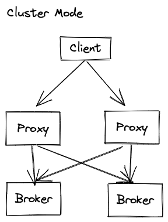
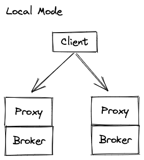

rocketmq-proxy
--------

## Introduction

`RocketMQ Proxy` is a stateless component that makes full use of the newly introduced `pop` consumption mechanism to
achieve stateless consumption behavior. `gRPC` protocol is supported now and all the message types including `normal`
, `fifo`, `transaction` and `delay` are supported via `pop`. `Proxy` will translate incoming traffic into
customized `Remoting` protocol to access `Broker` or `Namesrv`.

`Proxy` also handles SSL, authorization/authentication and logging/tracing/metrics and is in charge of connection
management and traffic governance.

### Multi-language support.

`gRPC` combined with `Protocol Buffer` makes it easy to implement clients with both `java` and other programming
languages. See [rocketmq-clients](https://github.com/apache/rocketmq-clients) for more information.

### Multi-protocol support.

With `Proxy` as a traffic interface, it's convenient to implement multiple protocols upon proxy. `gRPC` protocol is
implemented first and the customized `Remoting` protocol will be implemented later. HTTP/1.1 will also be taken into
consideration.

## Architecture

`RocketMQ Proxy` has two deployment modes: `Cluster` mode and `Local` mode. With both modes, `Pop` mode is natively supported
in `Proxy`.

### `Cluster` mode

While in `Cluster` mode, `Proxy` is an independent cluster that communicates with `Broker` with remote procedure call. In
this scenario, `Proxy` acts as a stateless computing component while `Broker` is a stateful component with local
storage. This form of deployment introduces the architecture of separation of computing and storage for RocketMQ.

Due to the separation of computing and storage, `RocketMQ Proxy` can be scaled out indefinitely in `Cluster` mode to
handle traffic peak while `Broker` can focus on storage engine and high availability.

### `Local` mode

`Proxy` in `Local` mode has more similarity with `RocketMQ` 4.x version, which is easily deployed or upgraded for
current RocketMQ users. With `Local` mode, `Proxy` deployed with `Broker` in the same process with inter-process
communication so the network overhead is reduced compared to `Cluster` mode.

## Deploy guide

See [Proxy Deployment](../docs/en/proxy/deploy_guide.md)

## Related

* [rocketmq-apis](https://github.com/apache/rocketmq-apis): Common communication protocol between server and client.
* [rocketmq-clients](https://github.com/apache/rocketmq-clients): Collection of Polyglot Clients for Apache RocketMQ.
* [RIP-37: New and Unified APIs](https://shimo.im/docs/m5kv92OeRRU8olqX): RocketMQ proposal of new and unified APIs
  crossing different languages.
* [RIP-39: Support gRPC protocol](https://shimo.im/docs/gXqmeEPYgdUw5bqo): RocketMQ proposal of gRPC protocol support.